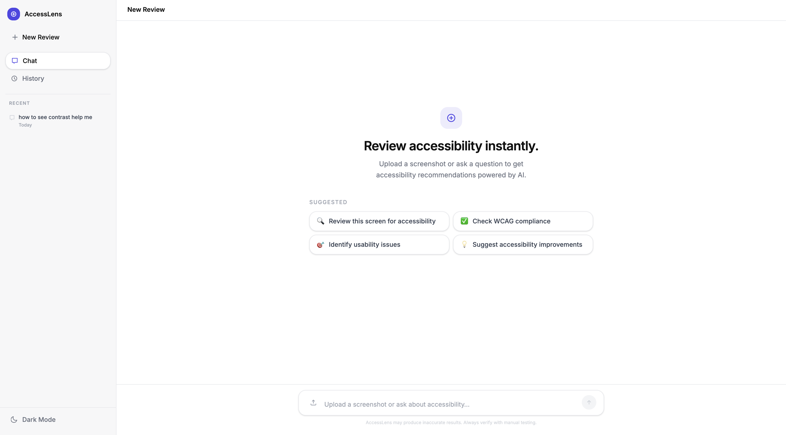

# AccessLens – AI-Powered Accessibility Checker

AccessLens is an AI-powered accessibility auditing platform built with React, TypeScript, and the Groq API that analyzes UI screenshots and generates structured WCAG 2.1 compliance reports, helping developers and designers identify accessibility issues early in the development process.

**[🌐 Live Demo](https://accessibility-ai-accesslens.vercel.app/)** • **[📂 Source Code](https://github.com/arunprakash12345/AccessibilityAI---Accesslens)** • **[🐞 Report Bug](https://github.com/arunprakash12345/AccessibilityAI---Accesslens/issues)**

## Homepage



---

## Why I Built This

Accessibility testing is often performed late in the development lifecycle, making issues expensive to fix. AccessLens was built to provide instant AI-assisted accessibility reviews by analyzing UI screenshots and generating actionable recommendations aligned with WCAG 2.1 guidelines.

---

## Key Capabilities

- AI-powered accessibility analysis using vision models
- Automated WCAG 2.1 compliance reporting
- Interactive accessibility assistant for follow-up questions
- Responsive React interface
- Local review history for quick access to previous analyses

---

## Features

- **Screenshot Analysis** — Upload UI screenshots and receive AI-generated accessibility reports with WCAG references.
- **Accessibility Chat Assistant** — Ask accessibility-related questions and receive contextual guidance.
- **Structured Reports** — Accessibility issues categorized with severity levels and recommendations.
- **Review History** — Stores previous analyses locally for quick access.
- **Dark Mode** — Enhanced usability in low-light environments.
- **Responsive Design** — Optimized for desktop, tablet, and mobile devices.

---

## Highlights

- AI Vision-powered screenshot analysis
- WCAG 2.1 accessibility evaluation
- React + TypeScript architecture
- Serverless backend using Vercel Functions
- Groq API integration
- Responsive UI
- Local persistence for review history

---

## Tech Stack

| Category | Technologies |
|----------|--------------|
| Frontend | React, TypeScript, Tailwind CSS, Vite |
| AI | Groq API, Qwen Vision Model, Llama 3.3 |
| Backend | Vercel Serverless Functions |
| Deployment | Vercel |

---

## Architecture

```text
React Client
      │
      ▼
Vercel Serverless Functions
      │
      ▼
Groq API
      │
      ▼
Vision & Language Models
      │
      ▼
Structured WCAG Report
```

---

## Run Locally

```bash
git clone https://github.com/arunprakash12345/AccessibilityAI---Accesslens.git

cd AccessibilityAI---Accesslens

npm install
```

Create a `.env` file.

```env
GROQ_API_KEY=your_api_key
```

Start the development server.

```bash
npm run dev
```

Visit:

```
http://localhost:5173
```

---

## Project Structure

```text
src/
├── components/
├── pages/
├── services/
├── hooks/
├── utils/
├── types/
└── assets/

api/
└── serverless-functions/
```

---

## Engineering Learnings

During the development of AccessLens, I gained experience with:

- Integrating AI vision and language models into web applications.
- Designing structured prompts for accessibility analysis.
- Building serverless APIs using Vercel Functions.
- Processing image uploads and AI responses efficiently.
- Developing responsive interfaces with React and TypeScript.
- Translating AI responses into structured, user-friendly reports.

---

## What's Next

- [ ] Export reports as PDF
- [ ] Accessibility scoring dashboard
- [ ] Authentication and cloud report storage
- [ ] Team workspaces
- [ ] Accessibility trend analytics
- [ ] Batch screenshot analysis

---

## Connect

- LinkedIn: https://www.linkedin.com/in/arunprakashux/
- GitHub: https://github.com/arunprakash12345

---

## License

This project is licensed under the MIT License.

> Built to explore AI-powered accessibility auditing using modern frontend technologies, serverless architecture, and large language models.
